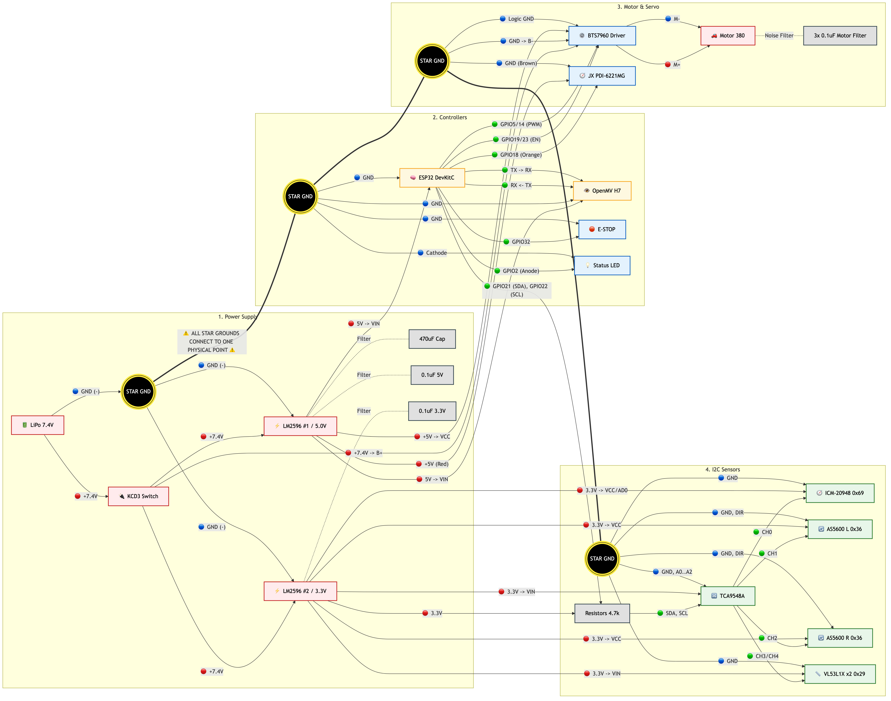

# 🔧 WRO Future Engineers — Полное руководство по сборке робота

> **Team Faith | Версия 2.0 | Апрель 2026**
>
> Этот документ описывает сборку робота **от распаковки до первого заезда**. Каждый шаг содержит проверочные точки (✅), фото-ориентиры 📸 и тайминги ⏱️. **Не переходите к следующему шагу, пока текущий не пройден.**

---

## Навигация по этапам

| # | Этап | Сложность | ⏱️ Время | Страница |
|:-:|------|:---------:|:--------:|:--------:|
| 1 | [Подготовка шасси](#этап-1-подготовка-шасси) | 🟢 | 2ч | ↓ |
| 2 | [Силовая цепь](#этап-2-силовая-цепь) | 🟡 | 3-4ч | ↓ |
| 3 | [Мотор и драйвер BTS7960](#этап-3-мотор-и-драйвер-bts7960) | 🟢 | 1-2ч | ↓ |
| 4 | [Рулевой серво](#этап-4-рулевой-серво) | 🟢 | 1ч | ↓ |
| 5 | [ESP32 — мозг](#этап-5-esp32--мозг) | 🟢 | 1ч | ↓ |
| 6 | [I2C шина (TCA9548A)](#этап-6-i2c-шина-tca9548a--датчики) | 🔴 | 3-4ч | ↓ |
| 7 | [Энкодеры AS5600](#этап-7-энкодеры-as5600) | 🔴 | 3-4ч | ↓ |
| 8 | [IMU (ICM-20948)](#этап-8-imu-icm-20948) | 🟡 | 2ч | ↓ |
| 9 | [Камера OpenMV H7 Plus](#этап-9-камера-openmv-h7-plus) | 🟡 | 2ч | ↓ |
| 10 | [VL53L1X ToF (опционально)](#этап-10-vl53l1x-tof-опционально) | 🟢 | 1ч | ↓ |
| 11 | [Кнопка E-STOP](#этап-11-кнопка-e-stop) | 🟢 | 30м | ↓ |
| 12 | [LED индикатор](#этап-12-led-индикатор) | 🟢 | 15м | ↓ |
| 13 | [Сборка проводки](#этап-13-финальная-сборка-проводки) | 🟡 | 2-3ч | ↓ |
| 14 | [Прошивка ПО](#этап-14-прошивка-по) | 🟡 | 2ч | ↓ |
| 15 | [Калибровка и первый запуск](#этап-15-калибровка-и-первый-запуск) | 🔴 | 4-6ч | ↓ |

---

## Подготовка: Инструменты и расходники

### 🔧 Обязательные инструменты

| # | Инструмент | Применение | Где понадобится |
|:-:|------------|------------|:---------------:|
| 1 | Паяльник 25-40W + припой Sn60/Pb40 | Пайка разъёмов, конденсаторов, резисторов | Этапы 2-8 |
| 2 | Крестовая отвёртка PH1/PH2 | Крепёж шасси HSP, датчиков | Этапы 1,3,4 |
| 3 | Шестигранники 1.5/2/2.5мм | Шасси HSP, пиньон, энкодеры | Этапы 1,7 |
| 4 | Мультиметр цифровой | Проверка V, прозвонка, КЗ-тест | **Каждый этап!** |
| 5 | Штангенциркуль (0.1мм) | Измерение диаметра колёс для одометрии | Этап 1 |
| 6 | Бокорезы + стриппер | Обрезка и зачистка проводов | Этапы 2,13 |
| 7 | Термофен (или зажигалка) | Термоусадочные трубки | Этап 2,13 |
| 8 | Пинцет антистатический | Мелкие SMD-компоненты, магниты AS5600 | Этап 7 |

### 📦 Расходники

| Расходник | Кол-во | Критичность |
|-----------|:------:|:-----------:|
| Термоусадка 3/5/8мм | набор | ⚠️ Обязательно |
| Припой Sn60/Pb40 1мм | 1м | ⚠️ Обязательно |
| Флюс (канифоль или ЛТИ-120) | 1шт | ⚠️ Обязательно |
| Кабельные стяжки 100мм | 30+ шт | ⚠️ Обязательно |
| Двусторонний скотч 3M VHB | рулон | ⚠️ Обязательно |
| Dupont разъёмы папа-мама | 40 шт | ⚠️ Обязательно |
| Изолента | 1 рулон | Аварийный запас |
| Суперклей | 1 тюбик | Фиксация магнитов AS5600 |
| Горячий клей | 3-4 палочки | Фиксация Dupont |
| Поролон 3мм | 5×5 см | Виброизоляция IMU |

---

## Подготовка: Проверка комплектации BOM

> **⚠️ СТОП!** Перед началом сборки проверьте **ВСЕ** компоненты по списку. Обнаружить отсутствие детали на этапе 10 = потерять целый день.

### Механика и шасси
- [ ] Шасси HSP 94182 1/16 4WD (в сборе: колёса + подвеска + мотор 380)
- [ ] Пиньон 16T M0.6 Ø2.3мм (проверить шаг! если стоковый M0.48 — купить отдельно)
- [ ] Серво JX PDI-6221MG 90-120° (с крепежом и качалками в комплекте)

### Электроника — контроллеры
- [ ] ESP32 DevKitC V4 (**38 пинов**, проверить USB-C или micro-USB)
- [ ] OpenMV Cam H7 Plus (проверить: с модулем камеры + USB-кабель)

### Электроника — датчики и драйверы
- [ ] BTS7960 43A драйвер мотора (8-пиновый разъём)
- [ ] GY-ICM20948V2 IMU (⚠️ **маркировка ICM-20948**, НЕ MPU-6050!)
- [ ] AS5600 магнитный энкодер × 2 шт (⚠️ **магнит Ø6мм в каждом комплекте!**)
- [ ] TCA9548A мультиплексор I2C (8 каналов)
- [ ] VL53L1X ToF × 2 (опционально — можно добавить позже)

### Питание
- [ ] Li-ion/LiPo 7.4V 2000mAh T-plug (⚠️ **заряжен!**)
- [ ] LM2596 DC-DC step-down × 2 шт
- [ ] Переходник T-plug → XT60 + пара XT60 разъёмов
- [ ] Переключатель KCD3 × 1 (⚠️ только ОДИН — правило WRO 9.10)
- [ ] Конденсаторы керамические 0.1 мкФ (маркировка 104) × 10 шт
- [ ] Резисторы 4.7 кОм × 4 шт (I2C pull-up)
- [ ] Резистор 220 Ом × 1 (LED)
- [ ] Резистор 10 кОм × 1 (E-STOP pull-up)

---

## Этап 1: Подготовка шасси

> ⏱️ ~2 часа | 🟢 Лёгкая сложность

### 1.1. Разборка лишнего

HSP 94182 идёт с приёмником, ESC и кузовом. Всё это нужно **полностью снять**:

**Порядок действий:**
1. Снять кузов — отогнуть клипсы по 4 углам, потянуть вверх
2. Найти и отключить стоковый ESC (электронный регулятор скорости) — 3 провода к мотору + 2 провода питания
3. Отключить стоковый приёмник — обычно подключён к ESC кабелем servo-connector
4. **Аккуратно** вытащить оба модуля из шасси
5. Оставить на шасси: подвеску, мотор 380, серво-крепление, колёса, карданные валы

> **⛔ НЕ СНИМАЙТЕ** рулевые тяги и рычаги подвески! Их геометрия настроена на заводе. Разборка без фото-фиксации = 2 часа потерянного времени на сборку обратно.

📸 *Сфотографируйте шасси ДО и ПОСЛЕ разборки — пригодится для v-photos/ репозитория.*

### 1.2. Замена пиньона (если нужно)

Проверьте шаг стокового пиньона. Если шаг M0.48 или M0.5 — заменить на M0.6:

1. Ослабить стопорный винт пиньона (шестигранник **1.5мм**)
2. Сдёрнуть пиньон с вала мотора. Если не идёт:
   - Нагреть феном пиньон 10 сек (50-60°C) → попробовать снова
   - Или использовать мелкий съёмник
3. Надеть **16T M0.6 Ø2.3мм** на вал
4. Затянуть стопорный винт **точно на лыске** вала (плоская площадка)
5. **Тест зазора:** вставить лист бумаги между зубьями пиньона и основной шестерни. Провернуть. Вынуть бумагу. Зазор ~0.1мм.

| Симптом | Причина | Решение |
|---------|---------|---------|
| Шестерни гудят | Зазор слишком тугой | Сдвинуть мотор на 0.1мм |
| Шестерни щёлкают | Зазор слишком свободный | Сдвинуть мотор ближе |
| Вибрация на высоких оборотах | Пиньон не на лыске | Переставить на лыску |

### 1.3. Установка серво JX PDI-6221MG

1. Вставить серво в штатное крепление HSP (прямоугольное окно)
2. Закрепить **4 винтами** из комплекта серво (с резиновыми втулками если есть)
3. **⚠️ КРИТИЧНО — качалка серво:**
   - **НЕ подавать питание на серво!** Качалка ставится при ВЫКЛЮЧЕННОМ питании
   - Рукой повернуть вал серво в **среднее положение** (механический центр)
   - Надеть качалку так, чтобы передние колёса смотрели **строго прямо**
   - Зафиксировать центральным винтом
4. Подключить рулевую тягу к качалке

### 1.4. Измерение диаметра колёс (для одометрии)

Это **критично** для точного подсчёта пройденного расстояния:

1. Снять ОДНО колесо
2. Штангенциркулем измерить **внешний диаметр** резины (слегка прижать — имитировать нагрузку)
3. Записать: **D = _____ мм**
4. Вычислить тиков на сантиметр:

```
Окружность C = π × D мм
TICKS_PER_CM = 4096 / C × 10

Пример: D = 75мм → C = 235.6мм → 4096/235.6 = 17.38 тиков/мм = 174 тиков/см
```

5. Записать значение — понадобится в `eps323.cpp`, строка `#define TICKS_PER_CM`

✅ **Чеклист этапа 1:**
- [ ] Шасси чистое: ESC, приёмник, кузов удалены
- [ ] Пиньон установлен, зубья не гудят и не щёлкают
- [ ] Серво установлено, качалка на центре, колёса прямо
- [ ] Диаметр колёс измерен и записан: D = _____ мм, TICKS_PER_CM = _____
- [ ] 📸 Фото чистого шасси сделано

---

## Этап 2: Силовая цепь

> ⏱️ 3-4 часа | 🟡 Средняя сложность
>
> **⛔ ПОЛЯРНОСТЬ!** Перепутать + и − на LiPo = **мгновенное** горение электроники. **Каждый провод** проверять мультиметром ПЕРЕД подключением.

### 2.1. Архитектура питания (WRO 2026 Compliant)

> **Правило WRO 9.10:** «Для включения транспортного средства разрешён **только один выключатель**».

```
LiPo 7.4V ──T-plug──▶ Переходник T→XT60 ──▶ XT60 разъём
                                                  │
                                         KCD3 (ЕДИНСТВЕННЫЙ!)
                                                  │
                                    ┌─────────────┼─────────────┐
                                    │             │             │
                                    ▼             ▼             ▼
                              BTS7960 (VCC)  LM2596 #1     LM2596 #2
                              7.4V прямое    → 5.00V       → 3.30V
                              (мотор)        (ESP32,Серво)  (OpenMV,I2C)
```4

**Потребители по шинам:**

| Шина | Напряжение | Потребители | Макс. ток |
|------|:----------:|-------------|:---------:|
| **Силовая** | 7.4V | BTS7960 → Мотор 380 | ~8A пиковый |
| **5V** | 5.00V | ESP32 VIN, Серво JX PDI-6221MG | ~3A |
| **3.3V** | 3.30V | OpenMV VIN, TCA9548A, AS5600×2, ICM-20948 | ~0.5A |

### 2.2. Настройка LM2596 (ДО подключения электроники!)

> **⛔ Сначала настроить — потом подключать!** Если LM2596 по умолчанию выдаёт 12V → ESP32 сгорит.

**LM2596 #1 → 5V:**
1. Подключить IN+ и IN− к батарее (через временные крокодилы)
2. Включить батарею
3. Мультиметр на выход OUT+/OUT−
4. Маленькой отвёрткой **МЕДЛЕННО** крутить подстроечный резистор
5. Добиться показания **5.00V ± 0.05V**
6. Проверить под нагрузкой: подключить резистор 100Ом (50мА) — напряжение не должно просесть
7. Отключить, **пометить маркером «5V»**

**LM2596 #2 → 3.3V:**
1. Аналогично настроить на **3.30V ± 0.05V**
2. Проверить под нагрузкой
3. Пометить **«3.3V»**

### 2.3. Пайка силовой разводки

**Последовательность пайки:**

1. Отрезать 14AWG провод: красный 30см + чёрный 30см
2. Зачистить все концы на **5мм**
3. Припаять XT60 разъём к проводам от батареи (красный → +, чёрный → −)
4. **Красный (+)** от XT60 → через тумблер KCD3 → разветвить на 3 провода:
   - → BTS7960 пин B+ (14AWG — силовой!)
   - → LM2596 #1 IN+ (можно 22AWG)
   - → LM2596 #2 IN+ (можно 22AWG)
5. **Чёрный (−)** от XT60 → разветвить на 3 провода:
   - → BTS7960 пин B−
   - → LM2596 #1 IN−
   - → LM2596 #2 IN−
6. **Каждое соединение** закрыть термоусадкой 5мм

### 2.4. Фильтрация питания от EMI мотора

> Мотор 380 создаёт **мощные электромагнитные помехи**. Без фильтрации: I2C зависает, UART теряет пакеты, IMU дрейфует.

**Конденсаторы на мотор (3 штуки 0.1мкФ керамические «104»):**

```
        0.1µF
  (+)────┤├────(−)       ← между клеммами мотора
  (+)────┤├────(корпус)  ← плюс к корпусу мотора
  (−)────┤├────(корпус)  ← минус к корпусу мотора
```

**Дополнительные конденсаторы:**
- 0.1мкФ на входе BTS7960 (VCC-GND) — впаять прямо на плату
- 0.1мкФ на выходе LM2596 #1 (VOUT-GND)
- 0.1мкФ на выходе LM2596 #2 (VOUT-GND)
- **470мкФ электролитический** на шине 5V (защита от просадок при пуске мотора)

### 2.5. Проверка этапа 2 — мультиметром

**Порядок проверки (тумблер KCD3 ВКЛЮЧЁН):**

| # | Тест | Ожидание | Если не так |
|:-:|------|:--------:|-------------|
| 1 | V на LM2596 #1 выходе | 5.00V ±0.05V | Подкрутить подстроечник |
| 2 | V на LM2596 #2 выходе | 3.30V ±0.05V | Подкрутить подстроечник |
| 3 | КЗ-тест: + к − (7.4V) | ∞ (нет КЗ) | ⛔ Найти и устранить замыкание! |
| 4 | КЗ-тест: + к − (5V) | ∞ | ⛔ |
| 5 | КЗ-тест: + к − (3.3V) | ∞ | ⛔ |
| 6 | Тумблер OFF → V батареи | 0V на всех шинах | Тумблер неисправен |

✅ **Чеклист этапа 2:**
- [ ] LM2596 #1: 5.00V ± 0.05V (помечен маркером)
- [ ] LM2596 #2: 3.30V ± 0.05V (помечен маркером)
- [ ] KCD3 — единственный тумблер, контролирует ВСЁ питание
- [ ] Конденсаторы: 3 шт на моторе + 1 на BTS7960 + 2 на LM2596 + 1 электролит 470мкФ
- [ ] Все пайки закрыты термоусадкой
- [ ] Нет КЗ (мультиметр подтверждает)
- [ ] 📸 Фото силовой разводки

---

## Этап 3: Мотор и драйвер BTS7960

> ⏱️ 1-2 часа | 🟢 Лёгкая сложность

### 3.1. Таблица подключения BTS7960

| BTS7960 пин | Куда | Провод | Примечание |
|-------------|------|:------:|------------|
| **B+** | 7.4V от KCD3 (+) | 14AWG красный | Силовое питание мотора |
| **B−** | 7.4V от KCD3 (−) | 14AWG чёрный | Силовая земля |
| **M+** | Мотор клемма + | 14AWG | Направление вращения |
| **M−** | Мотор клемма − | 14AWG | Направление вращения |
| **VCC** (логика) | 5V от LM2596 #1 | Dupont | Логическое питание |
| **GND** (логика) | GND общий | Dupont | ⚠️ К общей GND! |
| **R_EN** | ESP32 **GPIO19** | Dupont | HIGH = мотор активен |
| **L_EN** | ESP32 **GPIO23** | Dupont | HIGH = мотор активен |
| **RPWM** | ESP32 **GPIO5** | Dupont | ШИМ «вперёд» |
| **LPWM** | ESP32 **GPIO14** | Dupont | ШИМ «назад» |

> **R_EN и L_EN** должны быть HIGH для работы мотора. В прошивке это делается автоматически в `setup()`. Если мотор не крутится — **первым делом** проверить эти 2 пина мультиметром: должно быть 3.3V.

### 3.2. Тест направления

1. Подключить всё по таблице
2. Загрузить временный тест-скетч (или основную прошивку)
3. В Serial Monitor подать команду вперёд
4. **Если колёса крутятся НАЗАД** → поменять M+ и M− местами на BTS7960
5. Зафиксировать провода

✅ **Чеклист этапа 3:**
- [ ] Мотор крутится в правильную сторону при команде «вперёд»
- [ ] BTS7960 не греется при холостом ходе (рукой — тёплый OK, горячий ⛔)
- [ ] Конденсаторы на клеммах мотора установлены (этап 2)

---

## Этап 4: Рулевой серво

> ⏱️ ~1 час | 🟢 Лёгкая сложность

### 4.1. Подключение JX PDI-6221MG

| Провод серво | Куда подключить | Цвет провода |
|:------------:|-----------------|:------------:|
| **+** (питание) | 5V от LM2596 #1 | Красный |
| **−** (земля) | GND общий | Коричневый |
| **Signal** | ESP32 **GPIO18** | Оранжевый |

> **⛔ НЕ питайте серво от пина 3.3V ESP32!** PDI-6221MG потребляет до **2.5A** при нагрузке — это мгновенно сожжёт LDO-регулятор ESP32.

### 4.2. Калибровка центра

1. Загрузить тестовый скетч на ESP32:
```cpp
#include <ESP32Servo.h>
Servo s;
void setup() { s.attach(18, 500, 2500); }
void loop() { s.write(90); delay(100); }
```
2. Подать питание 5V
3. Колёса должны встать **прямо**
4. Если не прямо → снять качалку, переставить на 1-2 шлица, повторить
5. Точная подстройка: если при `write(90)` колёса чуть влево → `SERVO_CENTER = 92`
6. Записать: **SERVO_CENTER = _____°** (обычно 88-92)

### 4.3. Тест диапазона

Изменить скетч: `s.write(45)` → пауза → `s.write(135)`. Колёса должны поворачиваться на полный угол **без заеданий и хруста**.

✅ **Чеклист этапа 4:**
- [ ] Серво центрировано: колёса прямо при SERVO_CENTER = _____°
- [ ] Полный диапазон 45°-135° без заеданий
- [ ] Серво питается от 5V LM2596, **НЕ** от ESP32
- [ ] Рулевая тяга подключена к качалке

---

## Этап 5: ESP32 — мозг

> ⏱️ ~1 час | 🟢 Лёгкая сложность

### 5.1. Физическая установка

1. Вставить ESP32 DevKitC V4 в макетную плату через гребёнку
2. Макетную плату закрепить на шасси (двусторонний скотч 3M VHB)
3. **USB-разъём** ESP32 должен быть доступен снаружи (прошивка + отладка)

> **⚠️ Расположение:** ESP32 **подальше от мотора и BTS7960!** EMI от мотора 380 вызывает сбои I2C и UART. Минимальное расстояние: **5 см**.

### 5.2. Звездообразная GND (критично!)

**Самая частая причина проблем — нет общей земли.**

Все GND провода сходятся в **ОДНУ точку** на макетной плате:

```
                    ┌─── ESP32 GND
                    ├─── BTS7960 GND (логический)
  ОБЩАЯ GND ───────├─── LM2596 #1 GND
  (одна точка)      ├─── LM2596 #2 GND
                    ├─── OpenMV GND
                    └─── Все датчики GND
```

### Полная структурированная схема (все узлы)



Файл схемы для редактирования: `../schemes/WRO_Full_System_Diagram.mmd`

> **⛔ НЕ делайте цепочку** GND→GND→GND→GND. Это создаёт земляные петли и наводки, которые вызывают случайные сбои I2C.

### 5.3. Питание ESP32

| ESP32 пин | Подключение |
|:---------:|-------------|
| **VIN** (или 5V) | 5V от LM2596 #1 |
| **GND** | Общая GND |

> **⛔ НЕЛЬЗЯ** питать ESP32 одновременно через VIN и USB! При отладке по USB → **отключить VIN**.

### 5.4. Что можно и нельзя вести через макетную плату

Используйте макетную плату как **сигнальную/распределительную** шину, но не как силовую магистраль.

Разрешено через макетную плату:
- сигналы GPIO (PWM, UART, I2C)
- слаботочные линии датчиков (3.3V)
- общая точка GND (звезда)

Не вести через макетную плату:
- питание мотора (7.4V -> BTS7960)
- питание сервопривода под нагрузкой (до 2.5A)
- любые линии с током > 0.5A

Рекомендация по силе:
- 5V к серво вести **отдельной парой проводов** от LM2596
- рядом с серво поставить электролит 470-1000мкФ между +5V и GND

✅ **Чеклист этапа 5:**
- [ ] ESP32 загорается при подаче 5V (синий LED мигает)
- [ ] Serial Monitor работает на 115200 бод
- [ ] GND общий: мультиметром прозвонить 0Ом между GND всех компонентов
- [ ] ESP32 расположен > 5см от мотора

---

## Этап 6: I2C шина (TCA9548A + датчики)

> ⏱️ 3-4 часа | 🔴 Сложная — самый капризный этап

### 6.1. Зачем TCA9548A

У нас 2× AS5600 (оба с адресом 0x36) и 2× VL53L1X (оба 0x29). Без мультиплексора они конфликтуют на одной I2C шине.

### 6.2. Подключение TCA9548A

| TCA9548A пин | Куда | Примечание |
|:------------:|------|------------|
| **VIN** | 3.3V от LM2596 #2 | Логическое питание |
| **GND** | Общая GND | |
| **SDA** | ESP32 **GPIO21** | Данные I2C |
| **SCL** | ESP32 **GPIO22** | Тактовая I2C |
| **A0** | GND | Адрес бит 0 → 0 |
| **A1** | GND | Адрес бит 1 → 0 |
| **A2** | GND | Адрес бит 2 → 0 |
| **RST** | Не подключен | Внутренний pull-up |

Итоговый адрес: **0x70** (все биты адреса = 0)

### 6.3. Pull-up резисторы (КРИТИЧНО!)

> ESP32 имеет слабые внутренние pull-up (~45 кОм). На частоте 400 кГц с проводами > 10см I2C **будет** сбоить. Внешние pull-up **обязательны**.

Подключить **4.7 кОм** резисторы:
- **SDA → 3.3V** (один резистор)
- **SCL → 3.3V** (один резистор)

Место: **на главной шине** ESP32 ↔ TCA9548A (максимально короткие провода).

> Pull-up ставятся **ТОЛЬКО** на главную шину. На каналах TCA pull-up **НЕ НУЖНЫ** — TCA буферизует сигнал.

### 6.4. Карта каналов TCA9548A

| Канал | Датчик | I2C адрес | Макс. длина провода |
|:-----:|--------|:---------:|:-------------------:|
| CH0 | ICM-20948 (IMU) | 0x69 | ≤ 10 см |
| CH1 | AS5600 (левый энкодер) | 0x36 | ≤ 25 см |
| CH2 | AS5600 (правый энкодер) | 0x36 | ≤ 25 см |
| CH3 | VL53L1X (фронт) | 0x29 | ≤ 20 см |
| CH4 | VL53L1X (бок) | 0x29 | ≤ 20 см |
| CH5-7 | *Свободны* | — | — |

> **⚠️ Длина проводов I2C** — критичный фактор! При 400 кГц максимум ~30см. Если длиннее → снизить `Wire.setClock()` до 100000.

### 6.5. Диагностика — запуск I2C сканера

1. Загрузить `src/esp32/scanerI2C.cpp` на ESP32
2. Serial Monitor → 115200 бод
3. **Ожидаемый результат:**
```
✅ TCA9548A (0x70): НАЙДЕН

Канал [0]: 0x69 — ICM-20948 (AD0=VCC)
Канал [1]: 0x36 — AS5600 (энкодер)
Канал [2]: 0x36 — AS5600 (энкодер)
Канал [3]: пусто
Канал [4]: пусто
...
✅ СТАТУС: ВСЕ ОБЯЗАТЕЛЬНЫЕ ДАТЧИКИ В НОРМЕ
```

### 6.6. Troubleshooting I2C

| Проблема | Вероятная причина | Решение |
|----------|-------------------|---------|
| TCA не найден | Нет pull-up или нет питания | Установить 4.7кОм pull-up; проверить 3.3V |
| Датчик на канале не найден | Провод SDA/SCL перепутан | Прозвонить провода |
| Случайные зависания | EMI от мотора | Добавить конденсаторы; укоротить провода |
| Все датчики пропадают | GND не общий | Прозвонить GND между ESP32 и TCA |

### 6.7. Recovery / rollback-процедура (если шина нестабильна)

Если после 2 повторных проверок I2C всё ещё нестабилен, делайте откат к минимальной конфигурации:

1. Отключить питание полностью (KCD3 OFF), подождать 10 сек
2. Оставить только: ESP32 + TCA9548A (без IMU/AS5600/VL53L1X)
3. Запустить сканер: должен находиться только `0x70`
4. Подключать датчики **по одному каналу** в порядке CH0 → CH1 → CH2, после каждого шага запускать сканер
5. Канал, после которого появилась ошибка, считать дефектным: заменить провод/разъём/датчик на этом канале

Критерий выхода из rollback:
- 3 последовательных запуска сканера без потери адресов
- нет ложных адресов на пустых каналах

✅ **Чеклист этапа 6:**
- [ ] TCA9548A отвечает на адресе 0x70
- [ ] Pull-up 4.7 кОм на SDA и SCL главной шины
- [ ] Все подключённые датчики видны сканером на правильных каналах
- [ ] Провода I2C < 30 см

---

## Этап 7: Энкодеры AS5600

> ⏱️ 3-4 часа | 🔴 Сложная — самый ответственный механический этап

### 7.1. Принцип работы

AS5600 — 12-битный магнитный энкодер. Магнит (Ø6мм, диаметрально намагниченный) крепится на вращающейся оси. AS5600 считывает через Hall-эффект → даёт **4096 позиций** за один оборот.

### 7.2. Установка магнитов

> **⛔ Самый сложный механический этап!** Магнит должен быть **точно над центром чипа** AS5600 на расстоянии **0.5-3 мм**. Смещение > 1мм от центра → невалидные данные.

**Для каждого энкодера (левый CH1, правый CH2):**

1. Определить ось, вращающуюся пропорционально колесу (полуось/карданный вал)
2. Приклеить магнит Ø6мм на **торец оси**:
   - Суперклей **маленькая капля** (клей не должен попасть на грань магнита, обращённую к чипу)
   - Или двусторонний скотч 3M тонкий
3. Закрепить плату AS5600 **напротив магнита** на расстоянии **1-2 мм**
4. **Тест:** вращать колесо рукой → значение AS5600 должно **плавно** меняться 0→4095→0

### 7.3. Подключение

| AS5600 пин | Куда | Примечание |
|:----------:|------|------------|
| VCC | 3.3V | От LM2596 #2 |
| GND | GND общий | |
| SDA | TCA CH1/CH2 SDA | Через мультиплексор |
| SCL | TCA CH1/CH2 SCL | Через мультиплексор |
| DIR | GND или N/C | Направление счёта |

### 7.4. Проверка в коде

Загрузить сканер и в Serial Monitor вывести `readEncoder(1)` / `readEncoder(2)`. При вращении колеса:
- ✅ **Хорошо:** значение плавно нарастает 0 → 500 → 1000 → ... → 4095 → 0
- ⛔ **Плохо:** скачки более чем на 100 за один тик → магнит слишком далеко или не центрирован

### 7.5. Recovery / rollback магнитов AS5600

Если данные энкодера невалидны (скачки, периодические -1, резкие обрывы одометрии):

1. Отключить питание
2. Снять плату AS5600 и аккуратно удалить магнит пинцетом
3. Удалить остатки клея с торца оси (изопропиловый спирт)
4. Поставить новый магнит по центру оси, зазор 1-2 мм, повторить тест из п. 7.4
5. Если проблема сохраняется: поменять местами датчики CH1/CH2

Интерпретация симптомов:
- смещение магнита: скачки значения >100 за один тик
- слишком большой зазор: периодические провалы, потеря считывания
- слабая фиксация: на вибрации появляются случайные ошибки и SAFE STOP по энкодеру

✅ **Чеклист этапа 7:**
- [ ] CH1 (0x36) — левый энкодер виден сканером
- [ ] CH2 (0x36) — правый энкодер виден сканером
- [ ] Левое колесо: значение плавно меняется при вращении рукой
- [ ] Правое колесо: значение плавно меняется при вращении рукой
- [ ] Магниты надёжно закреплены (потрясти робота — не отваливаются)

---

## Этап 8: IMU (ICM-20948)

> ⏱️ ~2 часа | 🟡 Средняя сложность

### 8.1. Подключение GY-ICM20948V2

| IMU пин | Куда | Примечание |
|:-------:|------|------------|
| VCC | 3.3V | ⚠️ Не 5V! |
| GND | GND | |
| SDA | TCA **CH0** SDA | Канал 0 = IMU |
| SCL | TCA **CH0** SCL | |
| AD0 | **3.3V** | Адрес = 0x69 |

> **⚠️ AD0 должен быть к 3.3V!** Код ожидает адрес **0x69**. Если AD0 = GND → адрес 0x68 → `icm.begin_I2C()` вернёт ошибку.

### 8.2. Физическая установка

1. Закрепить IMU **горизонтально** (ось Z ↑ вверх)
2. Ось X направить **вперёд** по ходу движения
3. **Виброизоляция (ОБЯЗАТЕЛЬНО):** поролон 3мм + двусторонний скотч 3M

> Без виброизоляции гироскоп дрейфует в **3-5 раз быстрее** от вибрации мотора 380.

### 8.3. Калибровка гироскопа

Автоматическая в прошивке (`calibrateGyro()` при старте):
- Робот стоит **неподвижно** 3 секунды
- Усреднение 300 значений Z-оси
- Результат `gyroZbias` → если bias > 0.05, подозрение на вибрацию

### 8.4. Recovery / rollback IMU

Если IMU не проходит проверку или дрейфует:

1. Проверить питание и адрес: VCC=3.3V, AD0=3.3V, адрес 0x69
2. Повторить калибровку на неподвижном роботе (колёса не должны касаться пола)
3. Временно отключить мотор и повторить калибровку

Критерии отката:
- если `gyroZbias > 0.05` два запуска подряд: повторить монтаж на более мягкой вибропрокладке
- если в статике дрейф yaw > 2° за 30 секунд: заменить провод IMU и сократить длину I2C
- если IMU периодически пропадает в сканере: откатиться к процедуре `6.7` и переобжать разъёмы CH0

✅ **Чеклист этапа 8:**
- [ ] IMU виден на CH0 (адрес 0x69)
- [ ] `calibrateGyro()` bias < 0.05
- [ ] При повороте робота рукой yawAngle плавно меняется в Serial Monitor
- [ ] IMU на виброизоляции, горизонтально, ось X вперёд

---

## Этап 9: Камера OpenMV H7 Plus

> ⏱️ ~2 часа | 🟡 Средняя сложность

### 9.1. Подключение UART (ESP32 ↔ OpenMV)

| OpenMV пин | ESP32 пин | Описание |
|:----------:|:---------:|----------|
| **P4 (TX)** | **GPIO16 (RX)** | Камера передаёт → ESP32 принимает |
| **P5 (RX)** | **GPIO17 (TX)** | ESP32 передаёт → камера принимает |
| **GND** | **GND** | Общая земля |
| **VIN** | **5V** от LM2596 #1 | Питание камеры |

> **⛔ TX ↔ RX перекрёстное подключение!** TX камеры идёт на RX контроллера и наоборот. Если подключить TX→TX — данные просто не пойдут (но ничего не сгорит).

> **Уровни напряжений:** OpenMV H7 Plus = 3.3V логика. ESP32 тоже 3.3V. Преобразователь уровней для UART **НЕ нужен**.

### 9.2. Физическая установка камеры

Правильная установка камеры — **ключ к успешному детектированию** объектов:

| Параметр | Значение | Почему |
|----------|:--------:|--------|
| **Высота** камеры от пола | **8-12 см** | Оптимально видит и столбы и линии |
| **Наклон** вниз от горизонта | **10-15°** (~12° идеально) | Баланс: видим далёкие столбы + линии на полу |
| **Ориентация** | Объектив смотрит вперёд | По ходу движения робота |
| **Фиксация** | Жёсткая! 3M + стяжка | Любая вибрация = дрожание кадра = ложные детекции |

**Что будет при неправильном угле:**
- Слишком горизонтально → не видит оранжевую/синюю линию на полу
- Слишком вниз → не видит далёкие столбы (>60см)
- Камера вибрирует → blob-ы «прыгают», PID дёргает рулём

### 9.3. Прошивка OpenMV (предварительная)

1. Подключить OpenMV к компьютеру через **USB** (не через UART!)
2. Открыть **OpenMV IDE**
3. Открыть `src/openmv/openmv_main.py`
4. **⛔ НЕ сохранять на камеру сейчас!** Сначала нужна калибровка порогов (Этап 15)
5. Пока можно нажать ▶ (Run) для теста — в Frame Buffer должна быть картинка

✅ **Чеклист этапа 9:**
- [ ] OpenMV IDE видит камеру через USB
- [ ] В Frame Buffer отображается живое изображение
- [ ] UART: в Serial Monitor ESP32 появляются какие-либо данные (пусть пока мусорные)
- [ ] Камера жёстко закреплена — не вибрирует при постукивании по шасси
- [ ] Высота 8-12 см, наклон ~12° вниз
- [ ] 📸 Фото установленной камеры (для v-photos/)

---

## Этап 10: VL53L1X ToF (опционально)

> ⏱️ ~1 час | 🟢 Лёгкая сложность
>
> Этот этап **можно пропустить** — код работает без них (`#ifdef USE_VL53L1X`). Добавите позже когда получите датчики.

### 10.1. Установка

**Фронтальный (TCA CH3):**
- Закрепить на передней части шасси, лазер смотрит **горизонтально вперёд**
- Высота: **3-5 см** от пола
- Должен «видеть» стену прямо перед роботом

**Боковой (TCA CH4):**
- Закрепить на правом (или левом) борту, лазер смотрит **вбок перпендикулярно**
- Высота: **3-5 см** от пола
- Используется для парковки вдоль стены

### 10.2. Подключение

| VL53L1X пин | Куда | Примечание |
|:-----------:|------|------------|
| VIN | 3.3V | От LM2596 #2 |
| GND | GND общий | |
| SDA | TCA CH3 или CH4 SDA | Через мультиплексор |
| SCL | TCA CH3 или CH4 SCL | Через мультиплексор |
| XSHUT | Не подключен | Внутренний pull-up |
| GPIO1 | Не подключен | Прерывание (не используем) |

### 10.3. Библиотека

Arduino IDE → Library Manager → `VL53L1X` → установить **Pololu VL53L1X**

### 10.4. Если VL53L1X не подключены

В прошивке `eps323.cpp` закомментировать строку:
```cpp
// #define USE_VL53L1X   ← закомментировать
```
Код будет работать без ToF, используя камеру для детекции стен.

✅ **Чеклист этапа 10:**
- [ ] VL53L1X видны сканером (CH3: 0x29, CH4: 0x29) — или пункт пропущен
- [ ] Рукой на 20 см — дистанция в Serial ~200мм
- [ ] Если не подключены — `USE_VL53L1X` закомментирован в коде

---

## Этап 11: Кнопка E-STOP

> ⏱️ ~30 минут | 🟢 Лёгкая сложность

### 11.1. Схема подключения (GPIO32)

Простой вариант — кнопка между GPIO32 и GND:

```
3.3V ──[внутренний pull-up ESP32]── GPIO32 ──[КНОПКА]── GND
```

Код использует `INPUT_PULLUP`, поэтому:
- **Кнопка НЕ нажата** → GPIO32 = HIGH (3.3V)
- **Кнопка нажата** → GPIO32 = LOW (GND) → E-STOP активен

> Для надёжности можно добавить **внешний pull-up 10кОм** с GPIO32 на 3.3V, но внутреннего pull-up ESP32 обычно достаточно.

### 11.2. Как работает E-STOP в прошивке

| Действие | Реакция робота |
|----------|----------------|
| **Нажать** E-STOP в STATE_INIT | LED начинает быстро мигать (готовность) |
| **Отпустить** E-STOP в STATE_INIT | 🏁 **Гонка началась!** Переход в STATE_TRACKING |
| **Нажать** во время гонки | ⛔ Мотор = 0, руль = центр, STATE_SAFE_STOP |
| **Отпустить** во время гонки | ▶️ Продолжение гонки, STATE_TRACKING |

### 11.3. Выбор режима (программный)

> **WRO Правило 9.9:** физические переключатели режима **запрещены**.

Перед компиляцией прошивки, в `eps323.cpp` (строка 48):
```cpp
#define OBSTACLE_CHALLENGE_MODE    // ← раскомментировать для Obstacle
// #define OBSTACLE_CHALLENGE_MODE // ← закомментировать для Open
```

✅ **Чеклист этапа 11:**
- [ ] Кнопка E-STOP: нажатие → Serial «E-STOP АКТИВИРОВАН»
- [ ] Отпускание → Serial «ПРОДОЛЖЕНИЕ ГОНКИ»
- [ ] Кнопка доступна снаружи робота (не закрыта деталями)
- [ ] Режим установлен через `#define` в коде

---

## Этап 12: LED индикатор

> ⏱️ ~15 минут | 🟢 Лёгкая сложность

### 12.1. Подключение

```
ESP32 GPIO2 ──[резистор 220Ом]──[LED анод (+)]──[LED катод (−)]── GND
```

Используйте **яркий LED** (синий или белый) — нужно видеть состояние с 2+ метров.

### 12.2. Таблица сигналов

| Поведение LED | Состояние робота | Что делать |
|:-------------:|------------------|------------|
| Мигает медленно (~1 Гц) | STATE_INIT — ждёт старт | Нажать → отпустить E-STOP |
| Горит постоянно | STATE_TRACKING — гонка | Наблюдать |
| Мигает быстро (~4 Гц) | STATE_FINISH — финиш | 🏁 Робот завершил 3 круга |
| Не горит | STATE_SAFE_STOP | E-STOP нажат / ошибка |

✅ **Чеклист этапа 12:**
- [ ] LED светит при HIGH на GPIO2
- [ ] LED не горит при LOW
- [ ] Виден с расстояния 2+ метров

---

## Этап 13: Финальная сборка проводки

> ⏱️ 2-3 часа | 🟡 Средняя сложность
>
> **⚠️ Неаккуратная проводка — причина 80% проблем на соревнованиях.** Потратьте время сейчас — сэкономите нервы на WRO.

### 13.1. Правила разводки

| Правило | Почему |
|---------|--------|
| **Силовые и сигнальные провода НЕ параллельно** | EMI наводки от 7.4V/8A линии на I2C |
| Силовые (LiPo→BTS→мотор) по **одной** стороне шасси | Изолировать помехи |
| Сигнальные (I2C, UART, PWM) по **другой** стороне | Чистый сигнал |
| Кабельные стяжки **каждые 5-7 см** | Вибрация не дёргает провода |
| **Слабина** на проводах к рулевому серво | Руль поворачивается — провод не должен натягиваться |

### 13.2. Защита от вибрации

1. Все Dupont-разъёмы — **капля горячего клея** на стыке (предотвращает отход)
2. Каждый паяный провод — подёргать рукой (тест на обрыв)
3. Макетная плата — скотч 3M **+ кабельная стяжка** через крепёжные отверстия

### 13.3. Финальная прозвонка мультиметром

| # | Тест | Ожидание | Если не так |
|:-:|------|:--------:|-------------|
| 1 | КЗ: 7.4V+ ↔ GND | Нет (∞) | ⛔ Найти замыкание! |
| 2 | КЗ: 5V+ ↔ GND | Нет (∞) | ⛔ |
| 3 | КЗ: 3.3V+ ↔ GND | Нет (∞) | ⛔ |
| 4 | GND всех компонентов | 0 Ом между собой | Нет общей GND → исправить |
| 5 | SDA ↔ SCL | Не замкнуты | Перепутаны провода |

✅ **Чеклист этапа 13:**
- [ ] Силовые и сигнальные провода разведены по разным сторонам
- [ ] Все провода зафиксированы стяжками
- [ ] Нет висящих/болтающихся проводов
- [ ] Нет КЗ (мультиметр подтверждает)
- [ ] Dupont-разъёмы закреплены горячим клеем
- [ ] 📸 Фото финальной проводки

---

## Этап 14: Прошивка ПО

> ⏱️ ~2 часа | 🟡 Средняя сложность

### 14.1. Arduino IDE — настройка

**1. ESP32 Board Package:**
- File → Preferences → Additional Board Manager URLs:
  `https://raw.githubusercontent.com/espressif/arduino-esp32/gh-pages/package_esp32_index.json`
- Tools → Board Manager → `esp32` by Espressif → установить

**2. Библиотеки (Library Manager):**
- `ESP32Servo`
- `Adafruit ICM20948`
- `Adafruit Unified Sensor`
- `VL53L1X` by Pololu (если используете ToF)

**3. Настройки платы:**

| Параметр | Значение |
|----------|----------|
| Board | ESP32 Dev Module |
| Upload Speed | 921600 |
| Flash Size | 4MB |
| Partition Scheme | Default |
| Port | *(выбрать порт ESP32)* |

### 14.2. Прошивка ESP32

1. Открыть `src/esp32/eps323.cpp`
2. Проверить настройки:
   - `#define TICKS_PER_CM` — ваше измеренное значение (Этап 1)
   - `#define SERVO_CENTER` — ваше значение (Этап 4)
   - `#define OBSTACLE_CHALLENGE_MODE` — раскомментировать/закомментировать
   - `#define USE_VL53L1X` — закомментировать если ToF не подключены
3. **Compile** (Ctrl+R) — убедиться нет ошибок
4. **Upload** (Ctrl+U)
5. Serial Monitor (115200) — ожидаемый вывод:
```
╔═══════════════════════════════════════╗
║   WRO v10.0 CHAMPIONSHIP EDITION      ║
╚═══════════════════════════════════════╝
РЕЖИМ: OBSTACLE (ПРЕПЯТСТВИЯ)
Калибровка гироскопа (3 сек)...
Bias: 0.002345
=== ГОТОВО ===
НАЖМИ E-STOP → ОТПУСТИ → СТАРТ!
```

### 14.3. Прошивка OpenMV

1. Подключить OpenMV к компьютеру через USB
2. Открыть OpenMV IDE
3. Открыть `src/openmv/openmv_main.py`
4. **Сначала** откалибровать пороги (Этап 15!)
5. После калибровки: Tools → Save Script to OpenMV Cam → сохранить как `main.py`
6. Камера начнёт работать автономно при следующем включении питания

### 14.4. Integration Smoke Test (обязателен перед Этапом 15)

Цель: убедиться, что все подсистемы работают **вместе**, до тонкой калибровки.

1. Включить питание, дождаться `=== ГОТОВО ===` в Serial Monitor
2. Проверить стартовую логику:
   - E-STOP нажат/отпущен → состояние INIT/TRACKING меняется корректно
3. Проверить аварийную остановку:
   - нажать E-STOP во время движения → мотор 0, руль в центр
4. Проверить камеру:
   - при подключенной OpenMV идут валидные UART-пакеты
   - отключить UART камеры: предупреждение по таймауту и переход в SAFE STOP
5. Проверить подсчёт кругов в сухом режиме:
   - в логах видны счётчики `lineLapCount/gyroLaps`

Критерий PASS:
- все пункты 1-5 выполнены без перезагрузки ESP32 и без потери I2C-датчиков

Критерий FAIL:
- при любом FAIL вернуться к этапам 6-9 и устранить проблему до начала Этапа 15

✅ **Чеклист этапа 14:**
- [ ] ESP32 прошит, Serial Monitor показывает «ГОТОВО»
- [ ] Калибровка гироскопа выдаёт bias < 0.05
- [ ] E-STOP нажать/отпустить — реакция в Serial
- [ ] OpenMV IDE видит камеру
- [ ] Integration Smoke Test пройден

---

## Этап 15: Калибровка и первый запуск

> ⏱️ 4-6 часов | 🔴 Сложная — самый важный этап!

### 15.1. Калибровка цветовых порогов (OpenMV)

> **⛔ Неправильные пороги = робот не видит столбы = врезается = DQ.**
> Калибровать при **ТОМ ЖЕ освещении**, что будет на соревнованиях!

**Порядок для каждого цвета:**

1. Подключить OpenMV к компьютеру, открыть `openmv_main.py`
2. Поставить робота на трек (или рядом с объектами нужных цветов)
3. **Tools → Machine Vision → Threshold Editor**
4. Направить камеру на целевой объект
5. Двигать ползунки **L, A, B** пока в маске не останется **ТОЛЬКО** нужный цвет
6. Записать значения (L_min, L_max, A_min, A_max, B_min, B_max) в код

| # | Цвет | Переменная в коде | Объект для калибровки |
|:-:|:----:|-------------------|----------------------|
| 1 | 🟠 | `THRESHOLD_ORANGE` | Оранжевая полоска на мате |
| 2 | 🔵 | `THRESHOLD_BLUE` | Синяя полоска на мате |
| 3 | 🔴 | `THRESHOLD_RED` | Красный цилиндр на треке |
| 4 | 🟢 | `THRESHOLD_GREEN` | Зелёный цилиндр на треке |
| 5 | 🩷 | `THRESHOLD_MAGENTA` | Малиновый парковочный блок |
| 6 | ⬛ | `THRESHOLD_WALL` | Чёрный борт трека |

### 15.2. Калибровка фокусной константы

1. Поставить **красный столб** ровно на **20 см** от камеры
2. Запустить скрипт, в IDE посмотреть raw `blob.w()` (ширина блоба)
3. Вычислить: `FOCAL_CONST = 20 × blob.w()`
4. Записать в `openmv_main.py` строку `FOCAL_CONST = _____`

### 15.3. Калибровка одометрии

Условия теста:
- поверхность: ровный мат/плитка без уклона
- движение: строго по прямой, без поворота руля
- дистанция: 100 см по рулетке с метками старта/финиша

1. Пометить стартовую позицию колеса маркером
2. Выполнить 3 прогона на 100 см
3. Для каждого прогона записать delta `totalDistLeft` из Serial Monitor
4. Вычислить среднее значение: `avg_delta = (run1 + run2 + run3) / 3`
5. Вычислить: `TICKS_PER_CM = avg_delta / 100`
6. Обновить `#define TICKS_PER_CM` в `eps323.cpp`, перепрошить, повторить контрольный прогон

Критерий PASS:
- ошибка дистанции ≤ 2 см на 100 см

Критерий FAIL:
- ошибка > 2 см → повторить шаги 2-6

### 15.4. Первый запуск — на полу (без трека!)

1. Поставить на **гладкий пол** (не на трек!) — безопаснее
2. Включить тумблер KCD3
3. LED мигает медленно = STATE_INIT ✅
4. Нажать E-STOP → LED быстро мигает → отпустить → LED горит = гонка ✅
5. Нажать E-STOP → робот остановился ✅
6. Отпустить → робот продолжил ✅

### 15.5. Первый заезд — Open Challenge

1. Закомментировать `#define OBSTACLE_CHALLENGE_MODE` → перепрошить
2. Поставить на трек (без столбов)
3. Запустить
4. Робот должен проехать **3 круга и остановиться**
5. Если не проехал — анализировать Serial Monitor

### 15.6. Заезд — Obstacle Challenge

1. Раскомментировать `#define OBSTACLE_CHALLENGE_MODE` → перепрошить
2. Расставить красные и зелёные столбы на треке
3. Запустить
4. Красные — объезд **справа**, зелёные — **слева**
5. 3 круга → парковка между малиновыми блоками

### 15.7. Live-тюнинг PID

Во время заезда можно менять PID через Serial Monitor **в реальном времени**:

| Команда | Пример | Что делает |
|:-------:|--------|------------|
| `P0.65` | Kp = 0.65 | Усилить коррекцию (резче руль) |
| `D0.25` | Kd = 0.25 | Усилить демпфирование (меньше колебаний) |
| `I0.003` | Ki = 0.003 | Усилить интеграл (убрать постоянный увод) |
| `G1.50` | Gyro Kp = 1.50 | Усилить коррекцию курса по гироскопу |

> Начните с `P0.55, D0.18, I0.002, G1.20` (значения по умолчанию) и подстраивайте.

✅ **Финальный чеклист:**
- [ ] Все 6 цветов откалиброваны в OpenMV
- [ ] FOCAL_CONST записан: _____
- [ ] TICKS_PER_CM записан: _____
- [ ] E-STOP работает (остановка + продолжение)
- [ ] Open Challenge: 3 круга + остановка ✅
- [ ] Obstacle Challenge: объезд столбов + парковка ✅
- [ ] LED показывает правильные состояния
- [ ] 📸 Видео успешного заезда записано (для video/)

---

## Типичные проблемы и решения

### 🔌 I2C проблемы

| Симптом | Причина | Решение |
|---------|---------|---------|
| Робот зависает через 5-10 сек | EMI мотора на I2C | Конденсаторы 0.1мкФ на моторе (3шт) |
| Энкодеры «пропадают» | Длинные провода + 400 кГц | Укоротить провода или `Wire.setClock(100000)` |
| TCA9548A не найден | Нет pull-up резисторов | Установить 4.7кОм на SDA + SCL |
| IMU выдаёт bias > 0.1 | Вибрация при калибровке | Робот НЕПОДВИЖЕН 3 сек + виброизоляция |
| Все датчики пропадают одновременно | GND не общий | Прозвонить все GND |

### 🎥 Камера не видит цвета

| Симптом | Причина | Решение |
|---------|---------|---------|
| Все пороги не работают | Авто-экспозиция/баланс белого включены | Убедиться `auto_gain=False, auto_whitebal=False` |
| Цвет «поплыл» при другом свете | Калибровка при другом освещении | Перекалибровать Threshold Editor на месте |
| Путает красный и оранжевый | Пороги LAB перекрываются | Сузить диапазоны в Threshold Editor |
| Камера не отвечает по UART | TX/RX не перекрёстно | Поменять RX↔TX |

### 🏎️ Робот едет криво

| Симптом | Причина | Решение |
|---------|---------|---------|
| Тянет вправо/влево | SERVO_CENTER неточен | Подобрать 88-92 экспериментально |
| Дёрганый руль | Шумная PID производная | Уменьшить `DERIVATIVE_ALPHA` (0.2-0.3) |
| Не попадает в повороты | BLIND_TURN_ANGLE мал | Увеличить до 88-92° |
| Проезжает стартовую линию | Cooldown слишком большой | Уменьшить `LINE_DETECT_COOLDOWN_MS` |
| Колебания руля (осцилляция) | Kp слишком высокий | Снизить через `P0.40` в Serial |

### 🔋 Питание

| Симптом | Причина | Решение |
|---------|---------|---------|
| ESP32 перезагружается при старте мотора | Просадка 5V | Конденсатор 470мкФ на 5V шину |
| Серво дёргается | LM2596 не даёт 2A+ | Проверить LM2596 под нагрузкой |
| Батарея «проседает» | Разряд ниже 6.4V | LiPo тестер с пищалкой |

---

## 🏆 Рекомендации для соревнования

1. **Распечатайте** этот документ и держите при себе на WRO
2. **Возьмите запасные:** Dupont провода, ESP32, стяжки, скотч 3M, изоленту
3. **Запишите** рабочие пороги цветов на бумагу (если IDE недоступна — восстановите быстро)
4. **Заряжайте** LiPo до 8.4V перед каждым раундом
5. **Прогрейте** робота одним тестовым кругом — гироскоп стабилизируется

---

> *«Engineering is the closest thing to magic that exists in the world.»* 
> 
> **— Team Faith, удачи! 🏆**