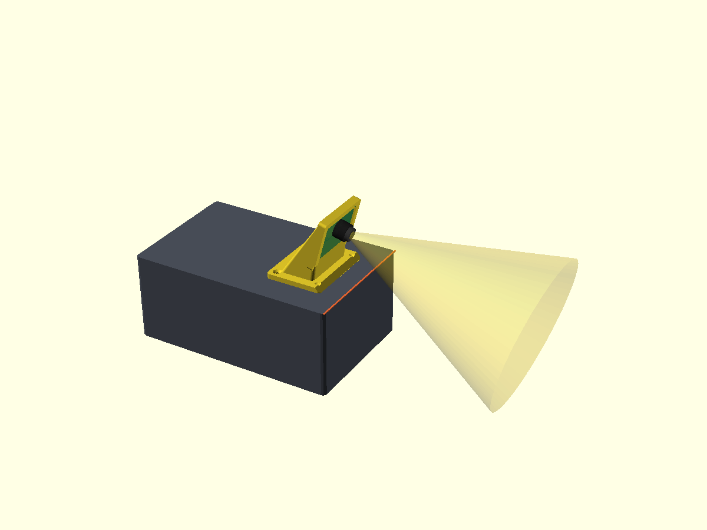

# OpenMV Cam H7 Plus — Camera Mount · Team Faith

Front-of-platform mount that holds the **OpenMV Cam H7 Plus** on the flat top
of the electronics box (165 × 105 × 70 mm), aimed **forward and tilted down**
so the lens sees the track lines + pillars ahead of the car.

Capture style: **edge-capture cradle** — the board drops into a pocket and is
held by retention lips on the two sides + top edge. No reliance on the board's
M2.5 hole spacing (OpenMV does not publish it).



---

## Files in this folder

| File | What it is | Tool |
|------|-----------|------|
| `openmv_h7_mount.scad` | **Printable part** — parametric source | OpenSCAD (free) |
| `openmv_h7_mount.stl`  | Pre-rendered mesh for the default sizes | any slicer |
| `assembly.scad`        | Visual install: box + mount + ghost camera + FOV cone | OpenSCAD |
| `assembly_iso/side/top.png` | Renders for the engineering journal | — |
| `README.md`            | This file | — |

> Export **`openmv_h7_mount.scad`** for slicing. `assembly.scad` is visual
> only — do **not** print it.

---

## OpenMV Cam H7 Plus — verified specs

| Spec | Value | Source |
|------|-------|--------|
| PCB outline | **45 × 36 mm** | openmv.io product page |
| Overall height | 29 mm (incl. M12 lens barrel) | openmv.io |
| PCB thickness | ~1.6 mm | standard |
| Sensor / optics | OV5640 on **M12 lens mount**, 2.8 mm lens | openmv.io |
| Mounting holes | 4 × **M2.5**, near corners | OpenMV forum |

⚠️ The H7 Plus PCB was laid out in Allegro by SingTown and OpenMV publishes
**no** mechanical drawing with hole-center spacing. The cradle therefore grips
the board **outline**, not its holes. If you want bolt-through instead, measure
the pattern yourself and set `BOLT_HOLES=true` + `BOLT_SP_L/W`.

---

## Step 1 — MEASURE before printing (critical)

Open `openmv_h7_mount.scad` and confirm these match calipers on your board:

```scad
CAM_L = 45.0;   // PCB long axis  (horizontal in the mount)
CAM_W = 36.0;   // PCB short axis (up the slope)
PCB_T = 1.6;    // PCB thickness
```

Edit + re-export if your board differs. Same rule as the AS5600 bracket.

---

## Step 2 — Set the aim

```scad
TILT_DEG = 15;   // lens downtilt below horizontal (10..30 typical)
```

This is a **fixed, printed** angle (most rigid, most repeatable). To change the
aim you re-print — there is no live hinge to drift under vibration. Start at 15°,
do a track-calibration run, and adjust:

- Sees too much sky / not enough near track → **increase** `TILT_DEG`
- Loses far pillars / sees mostly its own deck → **decrease** `TILT_DEG`

All other tunables (top of the file):

| Param | Default | Meaning |
|-------|---------|---------|
| `BOARD_FIT` | 0.30 | pocket clearance — loosen/tighten board fit |
| `LIP_GRAB` | 2.0 | how far the lips wrap onto the board face |
| `PEDESTAL_H` | 10 | gap under the board for cable routing |
| `CABLE_W` | 14 | slot in the bottom edge for header wires / USB |
| `BASE_BACK/FRONT` | 40 / 6 | base reach (support behind, short at front) |
| `SCREW_*` | M3 | base mounting holes (countersunk) |

---

## Step 3 — Preview in OpenSCAD

```bash
# the installation view (box + camera + FOV)
open -a "OpenSCAD-2021.01" assembly.scad     # macOS
# or the printable part on its own
open -a "OpenSCAD-2021.01" openmv_h7_mount.scad
```

Press **F5** (preview). In the part file, set `SHOW_GHOSTS = true` to overlay
the camera + field-of-view cone. Press **F6** then *File → Export → STL* to slice.

---

## Step 4 — Print

| Setting | Value |
|---------|-------|
| Material | **PETG** (PLA creeps / softens near electronics) |
| Layer height | 0.2 mm |
| Infill | 40–50 % |
| Walls | 3–4 perimeters |
| Supports | **none** (geometry is self-supporting) |
| Orientation | base flat on the bed |

Print time ≈ 1 h.

---

## Step 5 — Install

1. **Mount to platform.** Sit the base at the **front** of the box top so the
   lens overhangs the front edge. Either:
   - bond with double-sided VHB tape (flat underside), **or**
   - mark + drill the 4 countersunk M3 holes into the box top and screw down.
2. **Insert the camera.** Tuck the board's bottom edge into the pocket first,
   then press the top edge under the top lip until it snaps in. The lens points
   forward through the open front; the bottom slot routes the UART header wires
   (TX/RX/GND/5V) down into the box toward the ESP32-S3 (UART2, GPIO 17/18).
3. **Confirm the view.** Power on, open the OpenMV IDE framebuffer, and check
   the camera sees the track lines + pillars where you expect. Adjust
   `TILT_DEG` and re-print if needed.

---

## Step 6 — Verify (vision side)

- Lens is **level side-to-side** (no roll) — image horizon should be flat.
- Re-check `src/openmv/openmv_main.py` focal constant + LAB color thresholds
  *after* the camera is at its final height/angle (per the characteristics
  audit — both are TRACK-CALIBRATION REQUIRED).
- If the image is upside-down or mirrored, fix in firmware with
  `sensor.set_vflip(True)` / `set_hmirror(True)` / `set_transpose(True)` rather
  than re-mounting.

---

## What this design deliberately does NOT do

- **No live tilt hinge** — a pivot drifts under vibration; a printed angle is
  repeatable. Re-print to re-aim.
- **No bolt-through by default** — the M2.5 hole spacing isn't published, so the
  cradle grips the outline. Bolt-through is available (`BOLT_HOLES=true`) only
  if you measure the pattern.
- **No enclosure over the lens** — keep the optics and the M12 focus ring free.
