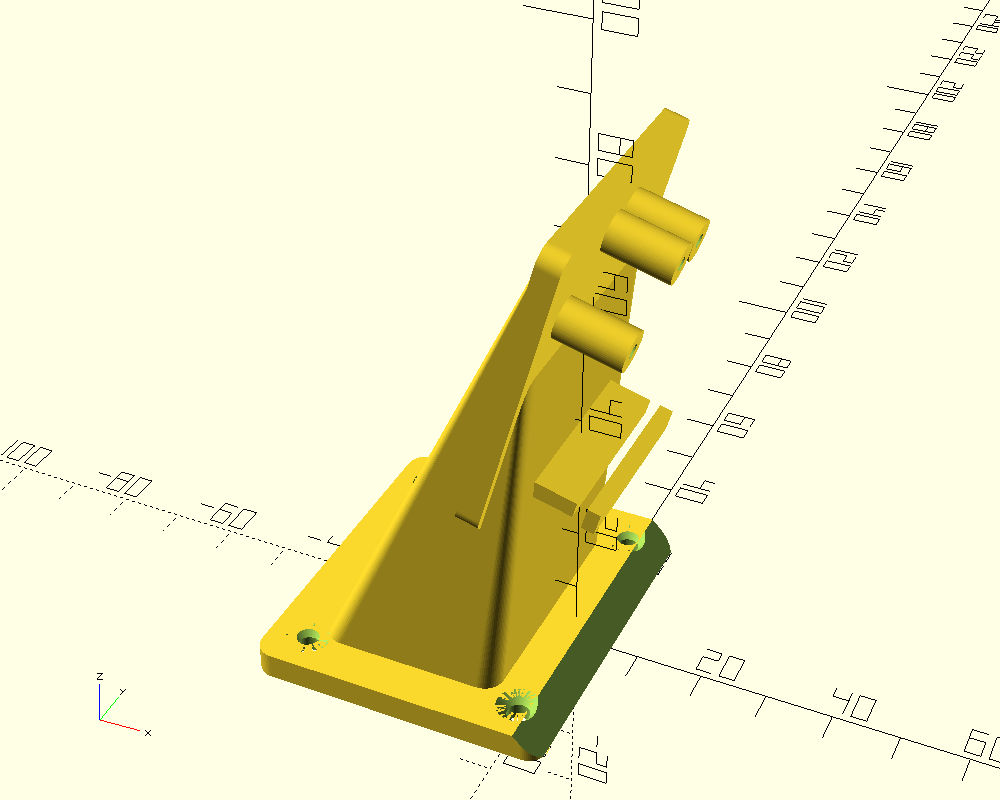
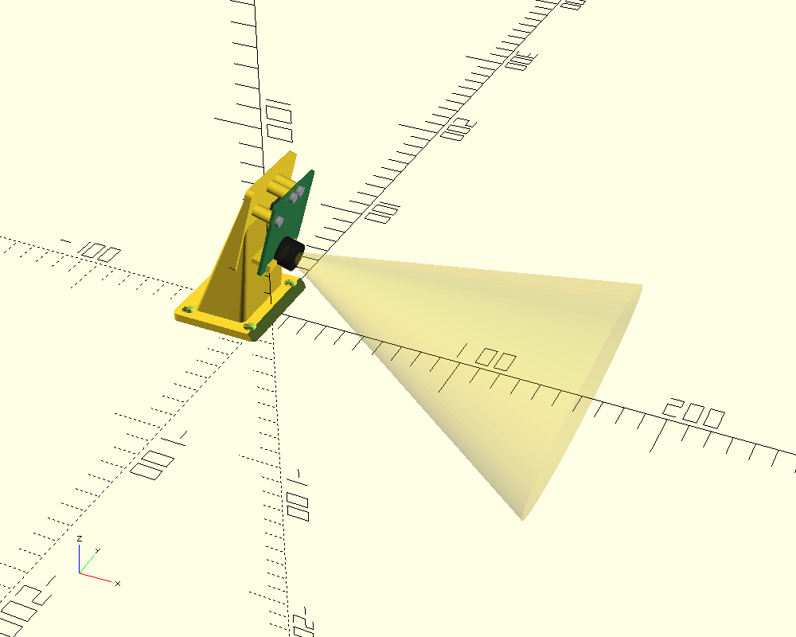
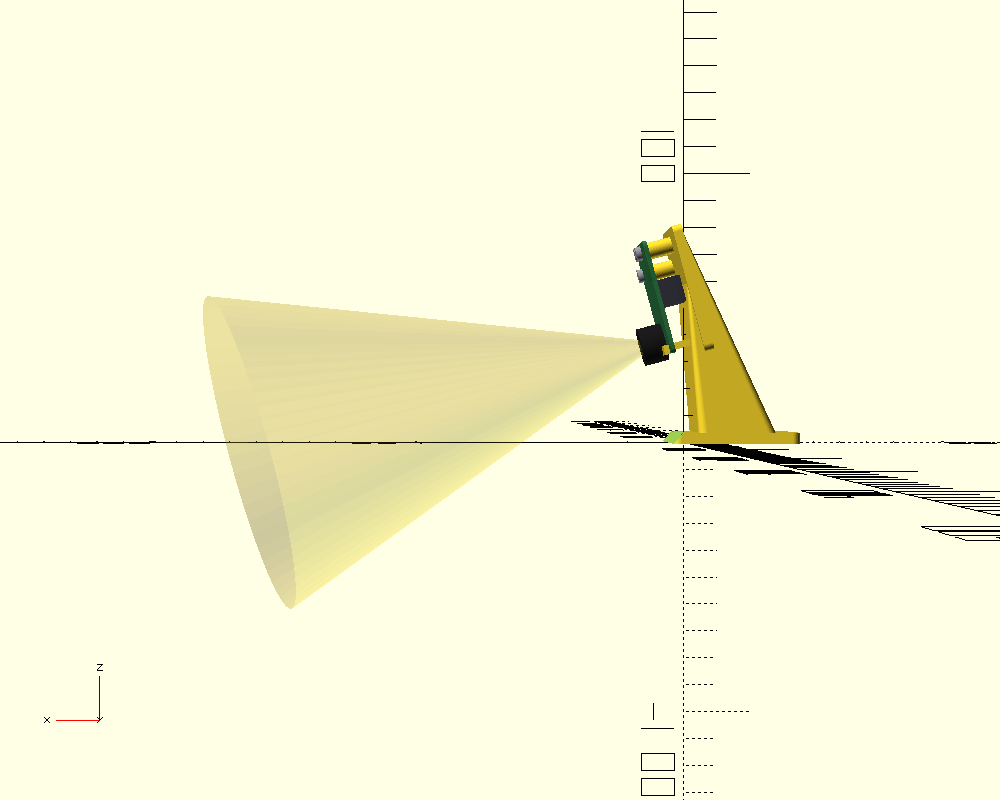

# Pixy2 / Pixy2.1 Camera Mount — WRO FE 2026 · Team Faith

Drop-in replacement for the OpenMV H7 mount after the OpenMV sensor module was
damaged (2026-06-12). Holds a **Pixy2 / Pixy2.1** board at the front of the
electronics box, aimed forward and tilted **15° down** so the lens sees the
track + pillars ahead. Reuses the **same base footprint** and matches the
**OpenMV lens height** so `PIXY_FOCAL_PIX` in `wro_config_v13.h` barely shifts.





## Capture style — bolt-through

The board bolts onto **3 printed standoff bosses** using Pixy2's own three
mounting holes. Screws enter from the **front** (lens side); all 3 holes sit
high on the board and the lens sits low, so the heads never touch the optical
path. The 10-pin ribbon hangs in the air gap behind the board and exits a slot
in the bottom edge of the backplate. A bottom lip carries the board's weight.

## ⚠️ Correction to WRO_Pixy2_Setup.md

That guide says "M2.5, 4 holes at the corners." The
[official dimensions](https://docs.pixycam.com/wiki/doku.php?id=wiki:v2:dimensions)
say otherwise — this mount follows the official numbers:

| Spec | Official value |
|---|---|
| PCB | **38.25 × 42 mm** |
| Mounting holes | **3 holes, ⌀3.0 mm** (not 4) |
| Hole coords (corner origin) | (5.1, 31.3) · (16.0, 38.8) · (22.4, 38.8) |
| Lens centre | (19.0, 5.0) — low/centred |
| Fasteners | Pixy ships **4-40**; **M2.5** also passes the 3 mm holes |

## Hardware

- **3 × M2.5 self-tapping screws** (~6–8 mm) — board → bosses. Default pilot
  `PILOT_D = 2.1` self-taps into PLA/PETG. *(4-40 self-tappers also work.)*
- **Optional upgrade:** set `HEATSET = true` to widen the pilot for M2.5
  heat-set inserts (more re-mate cycles, better for a vibrating robot).
- **4 × M3 screws** — base → chassis (countersunk from the top, same as the
  OpenMV mount's footprint).

## Print settings

PLA or PETG · 0.2 mm layer · ≥ 30 % infill (vibration) · **supports ON** under
the backplate overhang and the bosses · brim recommended (tall, narrow part).
Print orientation: base flat on the bed (as modelled).

## Assembly

1. Bolt the base to the chassis at the **same 4 holes** the OpenMV mount used.
2. Drop the Pixy onto the 3 bosses, ribbon facing down into the rear gap.
3. Drive 3 × M2.5 from the front through the board into the bosses — snug, not
   crushing the PCB.
4. Route the ribbon down through the bottom slot to the ESP32-S3 (GPIO17/18, 5 V, GND).

## Tuning parameters (`pixy2_mount.scad`)

| Param | Default | Note |
|---|---|---|
| `TILT_DEG` | 15 | lens downtilt — keep equal to the OpenMV mount |
| `LENS_TARGET_Z` | 40 | **MEASURE your built OpenMV mount's lens height and match it** |
| `STANDOFF` | 10 | board↔backplate gap; must clear the 10-pin connector |
| `PILOT_D` / `HEATSET` | 2.1 / false | M2.5 self-tap vs heat-set insert |
| `CONN_WINDOW` | false | cut a window for the connector if you shorten `STANDOFF` |
| `CABLE_W` | 14 | ribbon slot width |

## ⚠️ Verify with calipers before printing

Same rule as the AS5600 bracket and the OpenMV mount:
- `PCB_T` (PCB thickness, ~1.6)
- the **connector block** height/footprint → confirm `STANDOFF ≥` its protrusion
- your **built OpenMV mount's lens height** → set `LENS_TARGET_Z` to match

## Note: taller than the OpenMV mount

Because Pixy's lens sits near the **bottom** of a tall board, matching the
OpenMV lens height (~40 mm) puts the board top around **77 mm**. Held by 3 top
bolts + the bottom lip it's rigid, but the centre of mass is higher than the
OpenMV mount — keep the base screws tight and re-check after a few runs.

## Export

```bash
# from this folder
openscad -o pixy2_mount.stl pixy2_mount.scad
# fit-check renders (board + lens cone + connector ghosts):
openscad -o render_fit_iso.png -D 'SHOW_GHOSTS=true' --viewall --autocenter pixy2_mount.scad
```

Set `SHOW_GHOSTS = false` (default) before exporting the printable STL.
