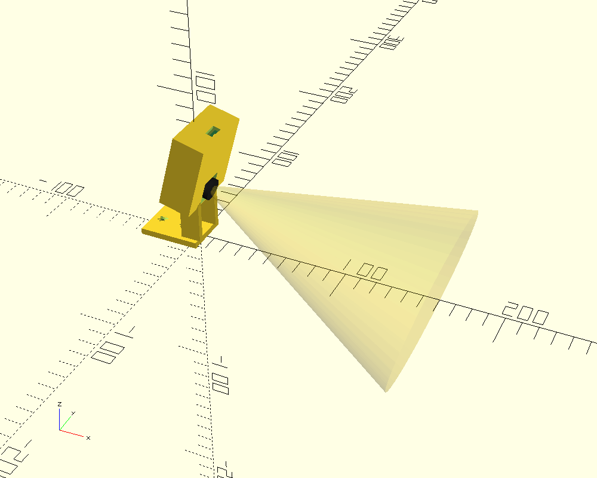
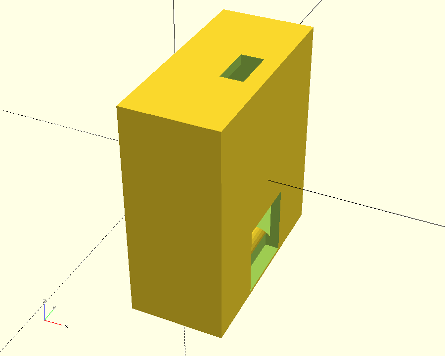
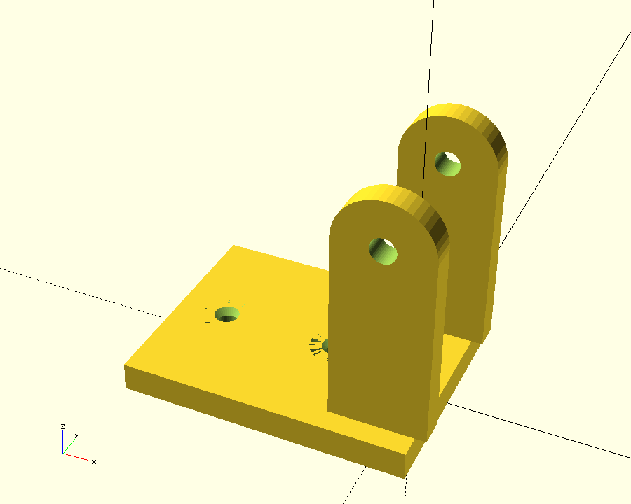

# Pixy2 / Pixy2.1 Tilt-Adjustable Cover — WRO FE 2026 · Team Faith

A box **cover** that encloses the Pixy2 and hangs on a **clevis hinge**, so the
camera downtilt is **adjustable** (loosen one M3, swing, re-tighten) instead of
the fixed 15° of [`models/Pixy2_mount`](../Pixy2_mount/). Modelled after the
GrabCAD "Pixy Camera Case" pivot concept, fitted to Pixy2's official geometry.





## Two printed parts

| Part | File | What it is |
|---|---|---|
| **Cover** | `cover.stl` | camera box: lens window, top button slot, open back, hinge barrel |
| **Bracket** | `bracket.stl` | L-foot (chassis screws) + clevis ears that straddle the barrel |

Render each from the one source:
```bash
openscad -o cover.stl   -D 'SHOW="cover"'   pixy2_tilt_cover.scad
openscad -o bracket.stl -D 'SHOW="bracket"' pixy2_tilt_cover.scad
# assembly fit-check (board + lens cone ghost):
openscad -o asm_iso.png -D 'SHOW="assembly"' -D 'SHOW_GHOSTS=true' --viewall --autocenter pixy2_tilt_cover.scad
```

## How the tilt works

The cover's hinge **barrel** (bottom-front) sits between the bracket's two
**clevis ears**, pinned by **one M3 screw**. Loosen → the cover swings about the
horizontal pivot axis → set the downtilt → tighten to **friction-lock**.

> ⚠️ **Locking:** a single M3 on a cantilevered box can creep under vibration.
> Use an **M3 nyloc** (not a plain nut) and tighten firmly; add a **serrated /
> star washer** under the head for grip. The wide `BARREL_R = 5` gives a large
> friction radius on purpose. If it still slips, raise `BARREL_R`, or add radial
> teeth to the barrel ends + ears (future upgrade).

## Hardware

- **1 × M3 × 20 + M3 nyloc** — the pivot pin.
- **3 × M2.5 self-tapping** (~6 mm) — board → the 3 internal bosses (Pixy2's
  own 3 × ⌀3 mm holes). Insert from the **open back**.
- **2 × M3** — bracket foot → chassis (countersunk from the top).

## Assembly

1. Drop the Pixy into the cover from the **open back**, lens into the front
   window, board onto the 3 bosses; drive 3 × M2.5 from the back.
2. Route the 10-pin ribbon out the open back / bottom relief.
3. Put the barrel between the bracket ears, push the M3 through, add the nyloc
   **loosely**.
4. Bolt the bracket foot to the chassis (2 × M3).
5. Power up, watch the Pixy view, swing to the downtilt you want, **tighten the
   M3**. Re-calibrate `PIXY_FOCAL_PIX` (§4 of WRO_Pixy2_Setup.md) at the chosen
   angle.

## Print settings

PLA/PETG · 0.2 mm · ≥ 30 % infill · supports ON.
- **Cover:** print open-back-down (back opening on the bed) → walls print as
  vertical perimeters; the hinge barrel needs a little support.
- **Bracket:** print foot-down; the clevis ears need support under the rounded
  tops.

## Key parameters (`pixy2_tilt_cover.scad`)

| Param | Default | Note |
|---|---|---|
| `TILT_DEG` | 15 | **demo angle for the render only** — real tilt is set by the hinge |
| `PIVOT_Z` / `PIVOT_X` | 30 / 0 | pivot-axis height / fwd-back vs chassis |
| `BARREL_R` / `BARREL_L` | 5 / 16 | hinge barrel size (friction radius / width) |
| `PIN_D` | 3.4 | M3 pivot clearance |
| `CONN_DEPTH` / `LENS_BARREL` | 11 / 9 | **MEASURE** connector + lens protrusion |
| `PCB_T` | 1.6 | **MEASURE** |
| `WIN_HALF` | 8 | lens window half-size (clears the 14 mm barrel) |

## ⚠️ Verify with calipers before printing

- `PCB_T`, the **lens-barrel length** (`LENS_BARREL`), and the **connector
  depth** (`CONN_DEPTH`) — these set the box depth and whether the lens reaches
  the window / the connector clears the interior.
- Pixy2 board + holes follow
  [official dims](https://docs.pixycam.com/wiki/doku.php?id=wiki:v2:dimensions):
  38.25 × 42 mm, 3 × ⌀3 mm holes at (5.1,31.3)(16,38.8)(22.4,38.8), lens (19,5).

## vs. the fixed mount

| | `Pixy2_mount` (fixed) | `Pixy2_tilt_cover` (this) |
|---|---|---|
| Tilt | fixed 15° (re-print to change) | **adjustable, locked by M3** |
| Protection | open cradle | **enclosed box cover** |
| Parts / hardware | 1 part, 3×M2.5 + 4×M3 | 2 parts, +1×M3 nyloc pivot |
| Risk | none moving | pivot can creep if under-tightened |

Use the fixed mount once the best angle is known; use this to **find** that
angle on the track, or if you want the lens protected.
