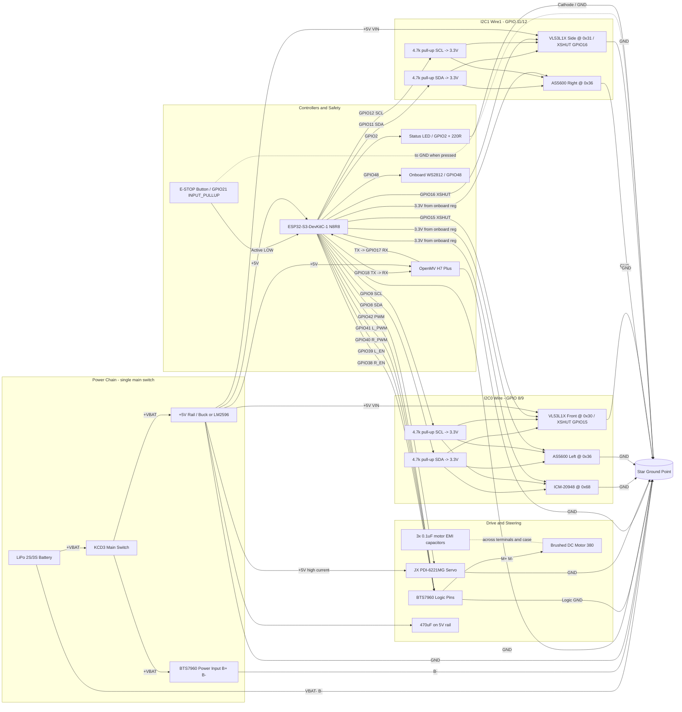

# WRO Full Structured System Diagram (v13)

> **Active hardware revision:** v13 — ESP32-S3-DevKitC-1 + 2× AS5600 dual-I2C + 2× VL53L1X (XSHUT-based runtime address remap).
> Full pin reference: [`docs/guides/WRO_Wiring_Map_v13.md`](../docs/guides/WRO_Wiring_Map_v13.md).
> Migration notes: [`docs/strategy/WRO_Migration_v12_to_v13.md`](../docs/strategy/WRO_Migration_v12_to_v13.md).

## Modules covered
- Power chain: LiPo 2S/3S, KCD3 main switch, 5 V rail, 3.3 V rail (onboard ESP32-S3 regulator)
- Controllers: ESP32-S3 (motion + sensor fusion), OpenMV H7 Plus (vision)
- Actuators: BTS7960 + brushed DC motor, JX PDI-6221MG steering servo
- Safety / status: E-Stop button, status LED, onboard WS2812 RGB
- I2C0 (Wire, GPIO 8/9): ICM-20948 (0x68) + AS5600 Left (0x36) + VL53L1X Front (0x29 → 0x30)
- I2C1 (Wire1, GPIO 11/12): AS5600 Right (0x36) + VL53L1X Side (0x29 → 0x31)
- VL53L1X XSHUTs on GPIO 15 / 16 (third reserved on GPIO 47)
- UART2: OpenMV camera (115200 baud, ASCII v3 protocol with XOR checksum)
- Grounding: star ground point

## Notes
- Do not route motor power through a breadboard.
- Keep I2C wiring short and away from motor power lines.
- The VL53L1X address-remap dance happens once at boot in `vl53l1x_dual.h` — XSHUTs are held LOW until the firmware is ready to bring each sensor up.
- OpenMV camera UART is ASCII v3 (`RedX,RedDist,GreenX,GreenDist,ModeFlag,ExtraTag*XX\n`). Spec: [`docs/guides/WRO_OpenMV_UART_Protocol.md`](../docs/guides/WRO_OpenMV_UART_Protocol.md).
- The rendered `WRO_Full_System_Diagram.png` / `.svg` in this folder are **stale renders from earlier revisions** — regenerate from this `.md`/`.mmd` when the bench wiring is finalized.
