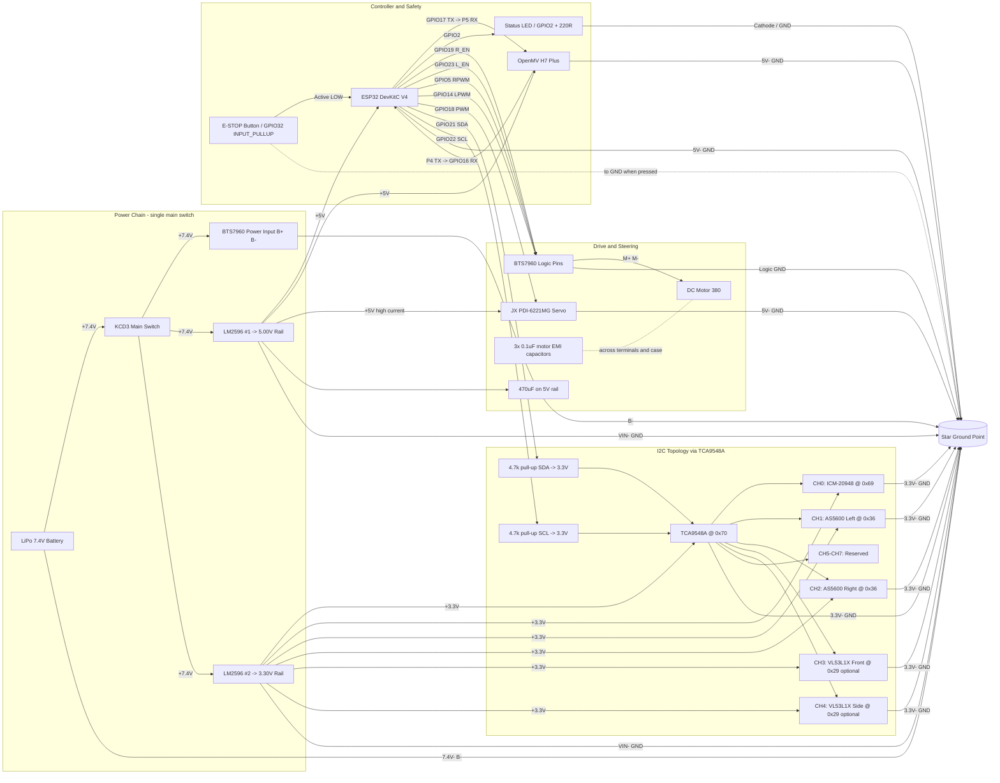

# WRO Full Structured System Diagram

This diagram includes all main modules from the assembly guide:
- Power chain: LiPo, KCD3, LM2596 #1 (5V), LM2596 #2 (3.3V)
- Controller and comms: ESP32, OpenMV UART
- Actuators: BTS7960 + DC motor, steering servo
- Safety and status: E-STOP, status LED
- I2C bus: TCA9548A + pull-ups + all sensor channels
- Grounding: star ground point

## Notes
- Do not route motor power through a breadboard.
- Keep I2C wiring short and away from motor power lines.
- Optional ToF modules are shown and can be disabled in firmware.
