# WRO Full System Diagram (v13)

> **Active hardware revision:** v13 — ESP32-S3-DevKitC-1 N8R8 + 2× AS5600 dual-I²C + 2× VL53L1X (XSHUT-based runtime address remap).
> Full pin reference: [`docs/guides/WRO_Wiring_Map_v13.md`](../docs/guides/WRO_Wiring_Map_v13.md).
> Short pin summary: [`WRO_Wiring_Map.md`](WRO_Wiring_Map.md).
> Migration notes: [`docs/strategy/WRO_Migration_v12_to_v13.md`](../docs/strategy/WRO_Migration_v12_to_v13.md).

This is the **master overview**. For per-subsystem detail use the focused views:

| Subsystem | File |
|---|---|
| Power rails (VBAT / 5 V / 3.3 V) | [`01_power_distribution.mmd`](01_power_distribution.mmd) |
| Control signals (UART, PWM, safety) | [`02_signal_control.mmd`](02_signal_control.mmd) |
| Dual I²C buses + XSHUT remap | [`03_i2c_buses.mmd`](03_i2c_buses.mmd) |
| Firmware FSM + sensor data flow | [`04_fsm_dataflow.mmd`](04_fsm_dataflow.mmd) |
| Top-down chassis layout (ASCII) | [`05_mechanical_layout.md`](05_mechanical_layout.md) |
| Full wire-by-wire schematic | [`WRO_Detailed_Wiring_Diagram.mmd`](WRO_Detailed_Wiring_Diagram.mmd) |

## What's in the master diagram

- **Power chain:** LiPo → KCD3 → +VBAT bus → LM2596 buck → +5 V → ESP32-S3 LDO → +3.3 V.
- **Controllers:** ESP32-S3-DevKitC-1 N8R8 (motion, fusion, FSM) and OpenMV H7 Plus (vision over UART2).
- **Actuators:** BTS7960 + brushed motor 380; JX PDI-6221MG steering servo.
- **Safety / status:** E-Stop on GPIO 21 with hardware interrupt, status LED on GPIO 2, onboard WS2812 on GPIO 48.
- **I²C0 (Wire, GPIO 8/9):** ICM-20948 (0x68), AS5600 Left (0x36), VL53L1X Front (0x30 after XSHUT remap from 0x29).
- **I²C1 (Wire1, GPIO 11/12):** AS5600 Right (0x36), VL53L1X Side (0x31 after XSHUT remap from 0x29).
- **XSHUT control:** GPIO 15 (front), GPIO 16 (side), GPIO 47 (reserved 3rd VL53L1X).
- **Grounding:** single star-ground point — every return ends there, including LiPo −.

```mermaid
flowchart TB

  classDef brain  fill:#fff8e1,stroke:#f9a825,stroke-width:2px,color:#000
  classDef cam    fill:#fff3e0,stroke:#ef6c00,stroke-width:2px,color:#000
  classDef act    fill:#fce4ec,stroke:#ad1457,stroke-width:2px,color:#000
  classDef sens   fill:#e8f5e9,stroke:#2e7d32,stroke-width:2px,color:#000
  classDef pwr5   fill:#ffebee,stroke:#c62828,stroke-width:2px,color:#000
  classDef pwr3   fill:#fff3e0,stroke:#e65100,stroke-width:2px,color:#000
  classDef pass   fill:#f3e5f5,stroke:#6a1b9a,stroke-width:1px,color:#000
  classDef io     fill:#e3f2fd,stroke:#1565c0,stroke-width:2px,color:#000
  classDef star   fill:#212121,color:#ffeb3b,stroke:#ffeb3b,stroke-width:4px

  subgraph POWER ["⚡ Power Chain"]
    direction LR
    BATT["LiPo 2S/3S<br/>7.4–11.1 V"]:::pwr5
    SW["KCD3<br/>Main Switch"]:::pwr5
    VBATT(["+VBAT bus"]):::pwr5
    BUCK["5 V Buck<br/>LM2596 / D-SUN"]:::pwr5
    V5(["+5 V rail"]):::pwr5
    V33(["+3.3 V rail<br/>ESP32-S3 onboard LDO"]):::pwr3
    BATT -->|+| SW --> VBATT
    VBATT --> BUCK --> V5
    V5 -. "VIN → 3V3 LDO" .-> V33
  end

  subgraph BRAIN ["🧠 Controllers"]
    direction TB
    ESP["<b>ESP32-S3-DevKitC-1</b><br/>N8R8 · 8 MB flash + 8 MB PSRAM"]:::brain
    OMV["<b>OpenMV H7 Plus</b><br/>vision · 115200 baud"]:::cam
  end

  subgraph ACT ["🚗 Actuators"]
    direction TB
    BTS["BTS7960<br/>43 A H-Bridge"]:::act
    MOT(["Motor 380<br/>brushed DC"]):::act
    SRV["JX PDI-6221MG<br/>digital servo"]:::act
  end

  subgraph IO ["🛡 Safety &amp; Status"]
    direction TB
    ESTOP["E-STOP button<br/>INPUT_PULLUP · active LOW"]:::io
    LED["Status LED + 220 Ω"]:::io
    RGB["Onboard WS2812"]:::io
  end

  subgraph I2C0 ["I²C0 — Wire · GPIO 8/9"]
    direction TB
    IMU["ICM-20948<br/>📍 0x68 · 3.3 V"]:::sens
    ASL["AS5600 Left<br/>📍 0x36 · 3.3 V"]:::sens
    TFF["VL53L1X Front<br/>📍 0x29→0x30 · 5 V"]:::sens
    PU0["4.7 kΩ pull-ups<br/>SDA/SCL → 3V3"]:::pass
  end

  subgraph I2C1 ["I²C1 — Wire1 · GPIO 11/12"]
    direction TB
    ASR["AS5600 Right<br/>📍 0x36 · 3.3 V"]:::sens
    TFS["VL53L1X Side<br/>📍 0x29→0x31 · 5 V"]:::sens
    PU1["4.7 kΩ pull-ups<br/>SDA/SCL → 3V3"]:::pass
  end

  GND((("⭐<br/>STAR<br/>GND"))):::star

  V5 ==>|+5 V| ESP
  V5 ==>|+5 V| OMV
  V5 ==>|+5 V high-I| SRV
  V5 ==>|+5 V VCC logic| BTS
  V5 ==>|+5 V VIN| TFF
  V5 ==>|+5 V VIN| TFS
  VBATT ==>|+VBAT B+| BTS

  V33 -->|3V3| IMU
  V33 -->|3V3| ASL
  V33 -->|3V3| ASR
  V33 -->|3V3| PU0
  V33 -->|3V3| PU1

  ESP <-->|"UART2 GPIO17 RX · 18 TX"| OMV
  ESP -->|"GPIO38 R_EN · 39 L_EN<br/>40 R_PWM · 41 L_PWM"| BTS
  BTS -->|M+ / M−| MOT
  ESP -->|"GPIO42 PWM @ 50 Hz"| SRV
  ESP -->|"GPIO21 HW interrupt"| ESTOP
  ESP -->|GPIO2| LED
  ESP -->|GPIO48| RGB

  ESP -->|"GPIO8 SDA · 9 SCL"| PU0
  PU0 --- IMU
  PU0 --- ASL
  PU0 --- TFF
  ESP -->|"GPIO15 XSHUT"| TFF

  ESP -->|"GPIO11 SDA · 12 SCL"| PU1
  PU1 --- ASR
  PU1 --- TFS
  ESP -->|"GPIO16 XSHUT"| TFS

  BATT -.->|−| GND
  V5 -.- GND
  V33 -.- GND
  ESP -.- GND
  OMV -.- GND
  BTS -.- GND
  MOT -.- GND
  SRV -.- GND
  IMU -.- GND
  ASL -.- GND
  ASR -.- GND
  TFF -.- GND
  TFS -.- GND
  ESTOP -.- GND
  LED -.- GND
```

## How to read the colours

| Class | Colour | Means |
|---|---|---|
| `pwr5` | red | +VBAT or +5 V rail |
| `pwr3` | orange | +3.3 V rail |
| `brain` | yellow | ESP32-S3 |
| `cam` | dark orange | OpenMV H7 Plus |
| `act` | pink | actuators (motor, servo, H-bridge) |
| `sens` | green | I²C / UART sensors |
| `io` | blue | safety + status I/O |
| `pass` | purple | passives (caps, pull-ups) |
| `star` | yellow-on-black | star ground |

Solid arrows are **power**; thick arrows (`==>`) are **high-current**; thin arrows are **signal**; dotted lines (`-.-`) are **ground returns**.

## Operational notes

- Do not route motor power through a breadboard. Solder the LiPo / BTS / motor / star-ground bundle directly.
- Keep both I²C trunks short (<20 cm), away from the motor wires, and on the opposite chassis side from the H-bridge.
- VL53L1X address-remap runs once at boot (`vl53l1x_dual.h`). All XSHUTs are held LOW until the firmware is ready to bring each sensor up one by one.
- OpenMV UART payload is ASCII v3: `RedX,RedDist,GreenX,GreenDist,ModeFlag,ExtraTag*XX\n`. See [`docs/guides/WRO_OpenMV_UART_Protocol.md`](../docs/guides/WRO_OpenMV_UART_Protocol.md).
- The PNG/SVG renders live in `renders/`. Regenerate from the `.mmd` source whenever the diagram changes (see [`README.md`](README.md)).
